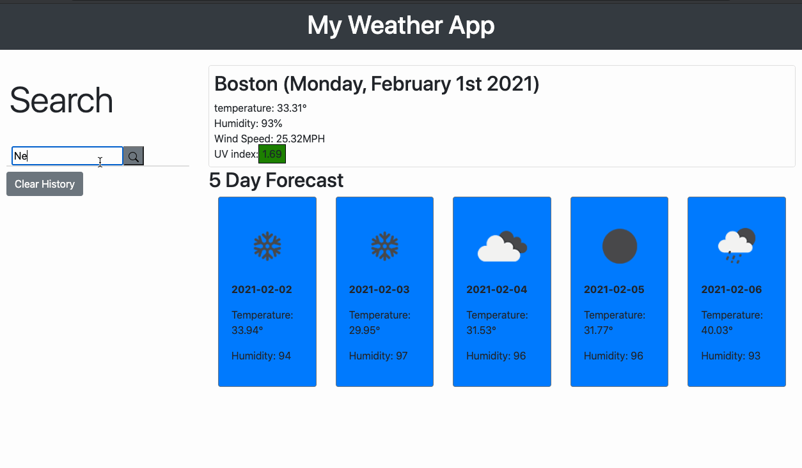

# My-Weather-app-MARC


## Description 
Welcome to your own personal Weather app! Weather you are an athlete trying wanting to know when you can and cannot not go out for a run, or you're a traveler wanting to see the weather of the next location you are going to. This app is for you! He you will be presented with a serch bar, there you will type the name of the city or location that you are visting or are currently in. You will then be presented with a container displaying the current weather forcast and as well as the five day forcast. Under your search bar you will have a history of the cities you have searched for. You will then have the option to clear all of your history through a button. with the text of "Clear History." 

## Technologies
* [JavaScript](https://www.w3schools.com/js/)
* [Bootstrap](https://getbootstrap.com/)
* [jQuery](https://jquery.com/)
* [momentsjs](https://momentjs.com/)
* [openweathermap](https://openweathermap.org/)
* [Ajax](https://developer.mozilla.org/en-US/docs/Web/Guide/AJAX)


## Features
* Gif of my Website. 



### Making Ajax Calls to API
- This is part of the function that makes an Ajax call to the open weather API. 

```
function currentWeather(cityName) {
  let queryURL =
    "https://api.openweathermap.org/data/2.5/weather?q=" +
    cityName +
    "&appid=" +
    apiKey +
    "&units=imperial";
  $.ajax({
    url: queryURL,
    method: "GET",
  }).then(function (response) {
    let tempEquation = response.main.temp;

    currentCity.text(response.name + currentDate);
    temp.text("temperature: " + tempEquation + "°");
    humidity.text("Humidity: " + response.main.humidity + "%");
    windSpeed.text("Wind Speed: " + response.wind.speed + "MPH");
```


### Making seperate Ajax Call for 5 day Forcast
- Here we are using Ajax to interact with the 5 day forcast. Then we loop through the response to only get the data that we need.

```
function get5Day(cityName) {
  $.ajax({
    url:
      "https://api.openweathermap.org/data/2.5/forecast?q=" +
      cityName +
      "&appid=" +
      apiKey +
      "&units=imperial",
    method: "GET",
  }).then(function (fiveResponse) {
    $(".fiveDayCon").empty();
    for (i = 0; i < 40; i = i + 8) {
      let cardDiv = $("<div>");
      let currentDay = fiveResponse.list[i];
      let temp = $("<p>").text("Temperature: " + currentDay.main.temp + "°");
      let currenTime = $("<p>").text(currentDay.dt_txt.substring(0, 10));
      currenTime.attr("style", "font-weight: bold;");
      let humidity = $("<p>").text("Humidity: " + currentDay.main.humidity);
      let iconImg = $("");
      iconImg.attr(
        "src",
        "https://openweathermap.org/img/wn/" +
          currentDay.weather[0].icon +
          "@2x.png"
      );
      cardDiv.attr(
        "class",
        "card card-body border border-secondary bg-primary"
      );
      cardDiv.append(iconImg, currenTime, temp, humidity);
      $(".fiveDayCon").append(cardDiv);
    }
  });
}
```

## Author
Ivan Torres
* [Deployed-Link](https://ivantorresmia.github.io/My-Weather-app-Ivan/)
* [GitHub-Repo](https://github.com/IvanTorresMia/My-Weather-app-Ivan)
* [linkedIn](www.linkedin.com/in/ivan-torres-0828931b2)

## Credits
* Always Giving Credit to past tutors and instructors that tought to code as well as friends who give me feed back on how to make my projets better.

* [StackOverFlow](https://stackoverflow.com/)


## License
[](https://www.mit.edu/~amini/LICENSE.md)